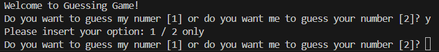
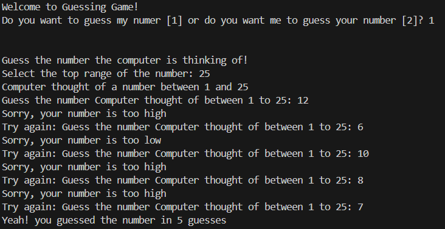
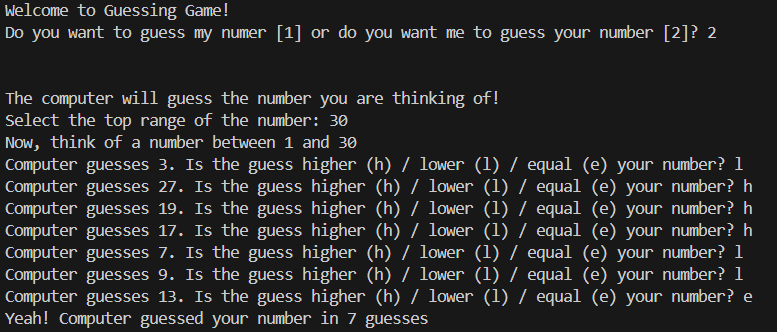

# Guessing the Number Game

Guessing the Number Game is a small cute game in cmd, combining two ideas from 12 beginners python projects.
The guessing game has 2 modes: 
1. Computer guesses the number user thought of by hints (low/high/equal) 
2. Computer generates a random number. User guesses it by hints (low/high)

## Running Rock, Paper, Scissors

` python  .\game.py `

## Code of Guessing the Number Game

Guessing the Number Game code holds 3 files:  
**game.py** - where the user chooses the mode of the game (who is guessing- computer or user) and triggers it.  
**guess_computer** - user guesses computer's number.  
**guess_user** - computer guesses user's number.
The code is very simple and straight forward. 

## Playing Guessing the Number Game

The game has 2 modes. once you run it, you will be asked to select the mode: 
1. Computer guesses the number user thought of by hints (low/high/equal) 
2. Computer generates a random number. User guesses it by hints (low/high) 
If you'll select an option other than 1 /2 you will be prompt.
 

 
If you select option 1-  you will be asked to guess the number the computer is thinking of. First, you'll be asked to enter the top range of numbers. Then, the computer will randomly select a number between 1-top. Enter your guess. you will be answered if it is lower or higher than the computer's pick. Continue untill you guess the number. Try to bit your previous number of guesses! 

 
If you select option 2- the computer will try to guess your number. First, you'll be asked to enter the top range of numbers. Now- think of a number between 1-top. The computer will guess the number. Indicate if the guess higher (h) / lower (l) / equal (e) to your number. Continue until computer guesses your number (equal)  

 

## Enjoy!
