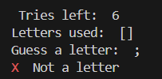

# Hangman ASCII art

Hangman ASCII art is an exercise I took from campusIL. It is ran in cmd and the visual is ASCII art.  
 

## Running Hangman ASCII art

` python .\FinalGame.py `  

## Code of Hangman ASCII art

Hangman ASCII art code holds 2 code files and 1 additional must-have file:  
**FinalGame.py** - holds the code for the game.  
**ascii_art.py** - holds the ascii art: 

**words.txt** - a file taken from the web, holding thousands of words in english. Hangman chooses a random word from this file. 
The Ascii art file holds a dictionary for each art. The main code calls each art according to its situation number. It requires colorama python libraries to show a bit of color in the cmd. 

## Playing Hangman ASCII art

Once ran, after the openning ASCII art, you will have the 4 elements that will guide you:  
1. word to guess with number of letters in the parentheses followed by underline for each letter. 
2. Hangman is the ASCII art of the status you are at (each wrong guess will promote the hanging man art).  
3. Tries left is how many times you can error (initialy 6).  
4. Letters used is an array of letters you have guessed before to help you not guess the same again. 

Now, all you need to do is to guess a letter. The letter you guesed will now be in the Letters used array, and if it is in the word- it will replace the relevant underline or underlines. 
If you guess before the man is hang (less than 6 tries)- you win and the man drops free from the hanging pole. If you do not guess the word in time- man stays hanged and you loose.
 

 
I did add some error handling for cases where you guess a charachter that isn't a letter / you guess a letter that was used before / you guess more than ine letter in a single guess: 
 

 

## Enjoy!