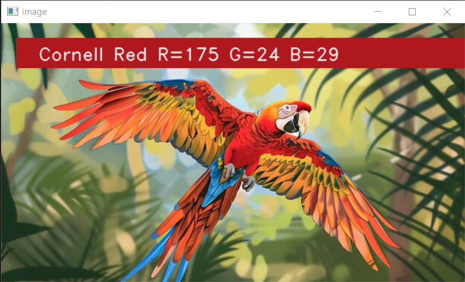
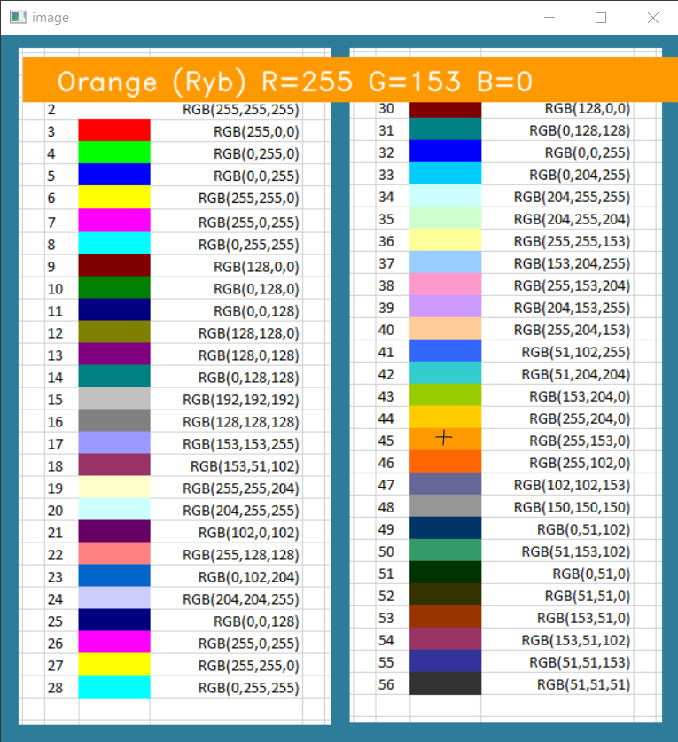
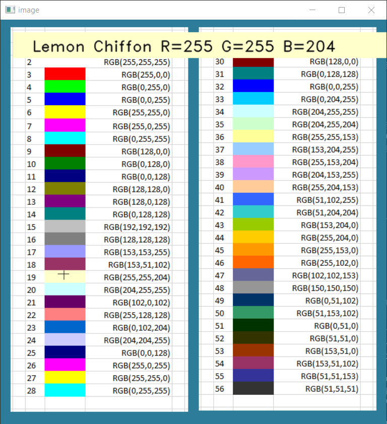
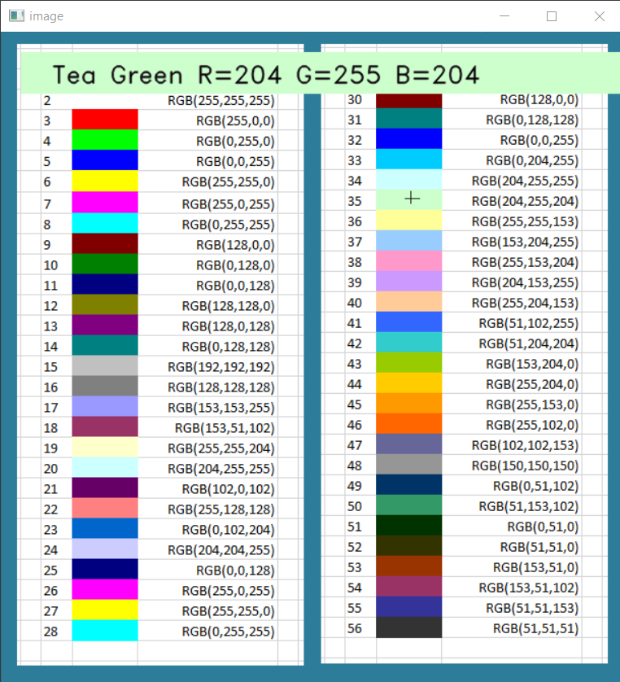
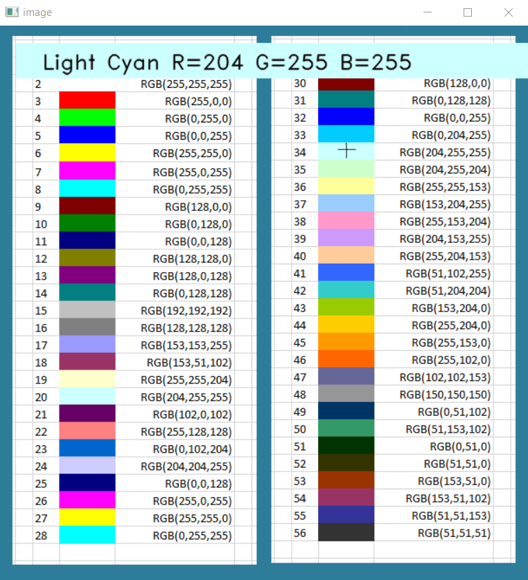
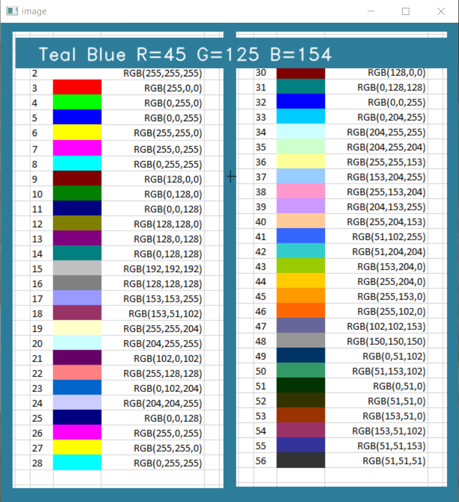

# Point Color Detection

Point Color Detection is a cute challenge I saw somewhere online.  
The idea is to open any image and double click a point on it to see the point's color name and RGB values.  

## Running Point Color Detection

` python color_detect.py -i img.jpg `  
replace img.jpg with the image of your selection.

## Code of Point Color Detection

Point Color Detection code holds 1 code file and 2 additional must-have files:  
**color_detect.py** - holds the code for the app.  
**colors.csv** - a csv file containing the RGB codes and the color name, taken from the web. 
**image file** - an image to open the app with. 
The code is pretty simple and straight forward. It requires opencv (cv2) and pandas python libraries. 
The image is read with cv2.imread. A cv2.setMouseCallback is set. Once a point (x,y) is double clicked, I'm searching for the color values in the image (img[x,y]). Then, I'm getting the most matching color from the csv file. This is done by calculate minimum distance from all colors. Last- I'm showing it ontop of the image.

## Playing Point Color Detection

Once ran, Point Color Detection opens a window with the image you gave in the running arguments. 
Double click any point on the image and you'll get the name and RGB codes with a solid bar of that color. In relation to the color of the bar, the text will appear black (over lighter colors) or white (over darker colors).  
Click escape or close the window to exit.

 

## Enjoy!