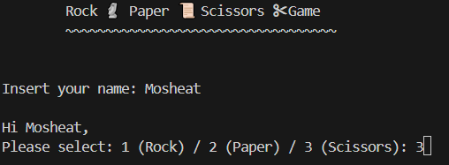

# Rock, Paper, Scissors

Classic Rock, Paper, Scissors game for 1 player (vs. computer).  
The game was created in python code, running in command line.  

## Running Rock, Paper, Scissors

` python  .\game.py `

## Code of Rock, Paper, Scissors

Rock, Paper, Scissors code holds 1 file:  
**game.py** - holds defaults of game visualizations (icons) and the logic and prints of the game.  
The code is very simple and straight forward. It requires random and time python libraries.

## Playing Rock, Paper, Scissors

The game is played by 1 player against the computer.  
Once opens, you will be asked to insert your name.
 

 
Next, you will be asked to insert your selection- 1/2/3.  

 
If you enter a number other than 1/2/3- you will get a validation error:  

 
Now the "processing" animation will run for a few seconds- it is the Rock, Paper, Scissors icons flashing one after the other. Once done, you'll get the results: what yoy chose, what the computer chose and if you win/loose/tie (Teko-Teko).
 

 

## Enjoy!