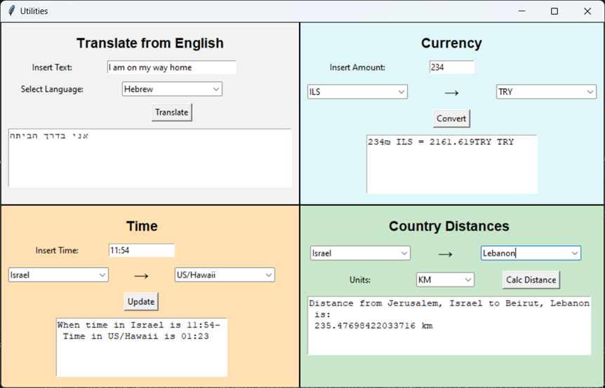
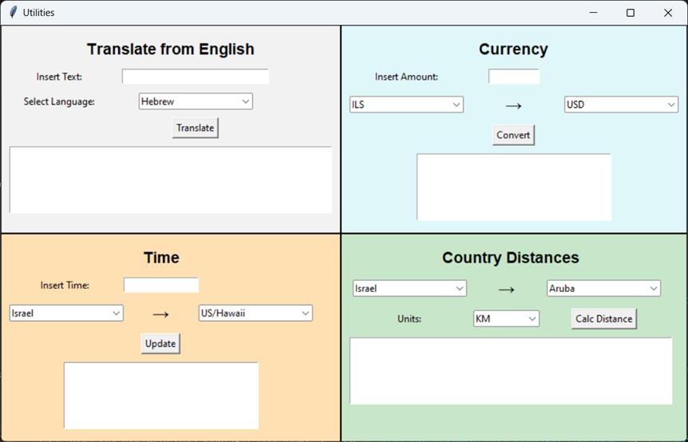

# The Four Utils

The Four Utils  
The game was created in python code, using tkinter for GUI.  

## Running The Four Utils

` python .\utils.pyy `

## Code of The Four Utils

The Four Utils code holds 2 files:  
**utils.py** - the python code file.  
**requirements.txt** - holds needed library installations.  
For visualizing the game, I used the 'TKinter' python interface library. 
For translation I used googletrans python library. 
For currency, I used currency_converter and forex_python python libraries. 
For time, I used pytz and datetime python libraries. 
For country distances I used geopy and sent request to https://restcountries.com/v3.1/name/{country_name}?fullText=true. 

## Playing The Four Utils

Run the utility. The window is divided into 4 sections, each holds a different utility. 
 

 
Each utility is stand alone and can be used regardless to the others. Simply insert the data you want to convert/calculate/translate and click the button of that util. 

 

## Enjoy!
