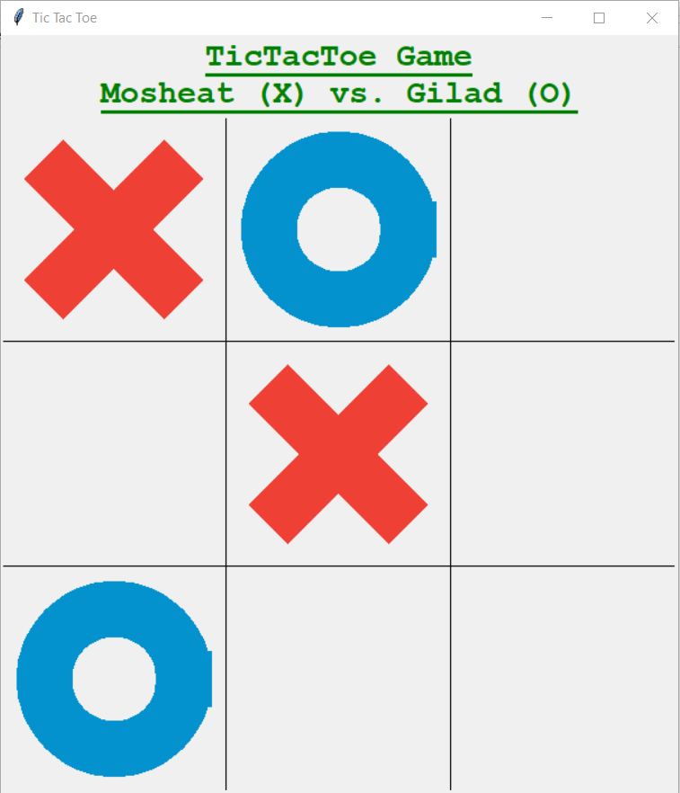
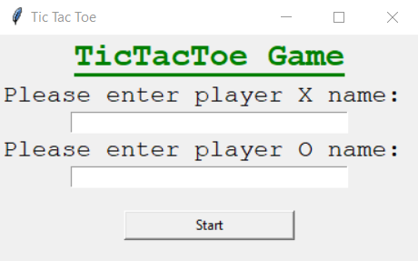
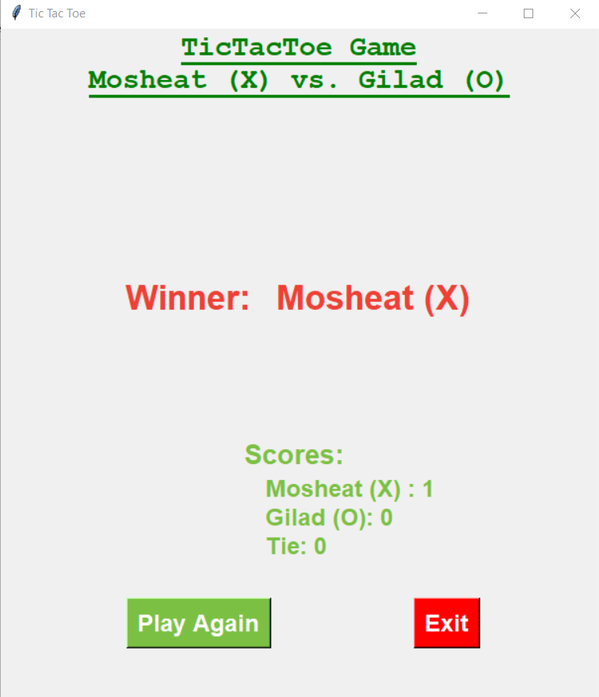
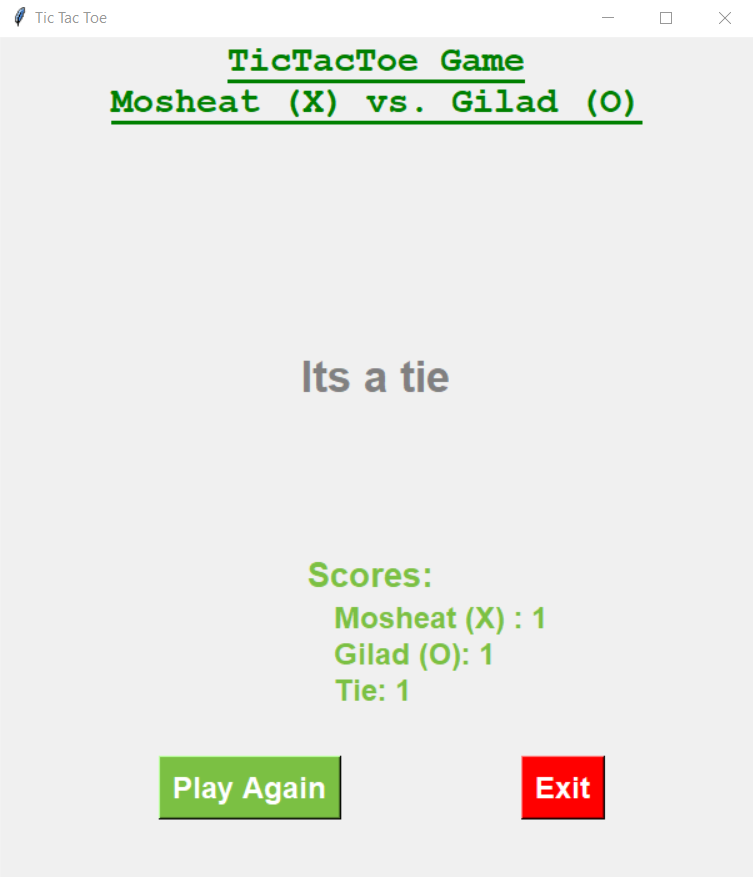

# Tic-Tac_toe Game (TKinter)

Classic Tic-Tac-Tow (X-O) game for two players.  
The game was created in python code, using tkinter for GUI.  

## Running Tic-Tac-Toe

` python  .\game.py `

## Code of Tic-Tac-Toe

Tic-Tac-Toe code holds 2 files:  
**game.py** - calls the clas 'TicTacToe' and mainloops on an instance of it.  
**TicTacToe.py** - holds defaults of game visualizations (size, colors) and the class 'TicTacToe' which holds visualizations and logic of the game.   
For visualizing the game, I used the 'TKinter' python interface library. 

## Playing Tic-Tac-Toe

The game is played by 2 players.  
Once opens, you will be asked to insert names for both players.
 

 
clicking 'Start' will open the main game screen, where each one of you, at his turn, clicks the square he wants to put his X/O in.  

 
There are 3 options for ending the game: X player wins, O player wins or Tie.  

 
If you choose to play gain- the game will restart while the other player starts (once X player starts, in the next game- O player starts and so on). The winning or tie numbers will be accumulated and shown each time you end a game, untill you'll exit.
 

 

## Enjoy!